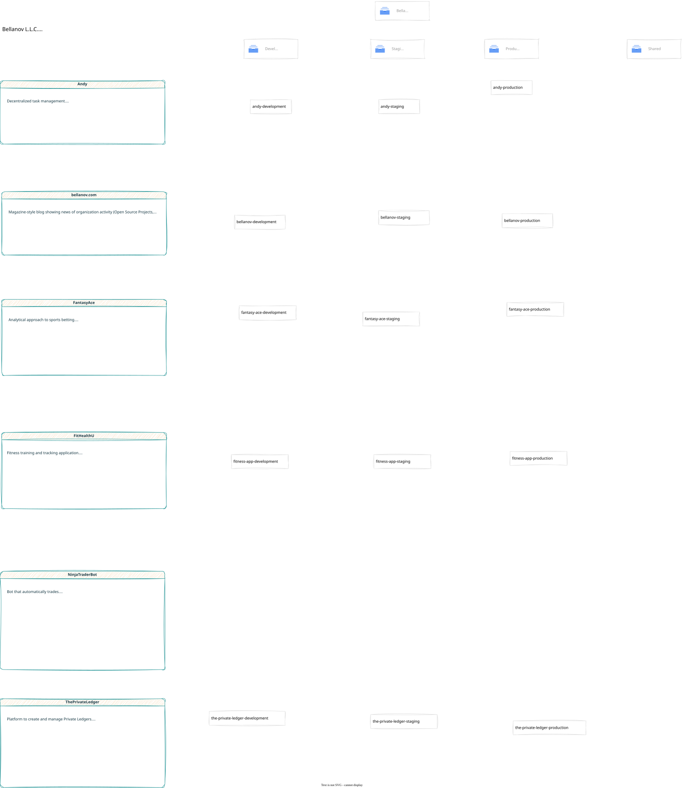
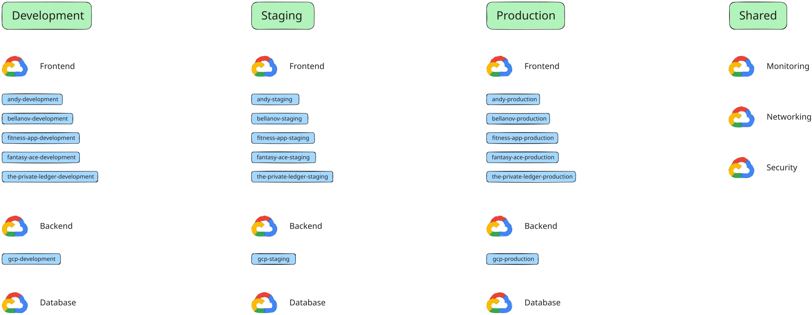

# Bellanov L.L.C.

Code for the *Bellanov L.L.C.* organization.

## Structure

The organization is defined across a series of **Folders** in *Google Cloud Platform (GCP)*.

## Projects

Projects are defined across development **Environments**, namely *Development*, *Staging*, *Production*, and *Shared*.

